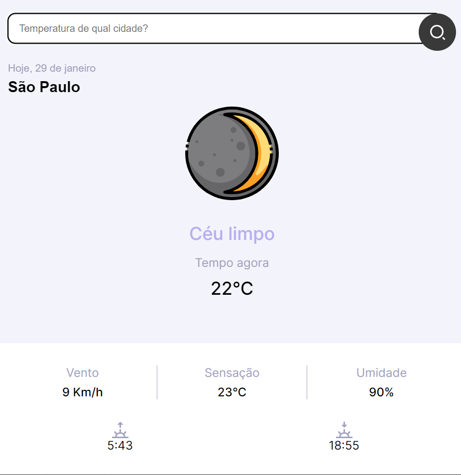

<h1 align="center"> SnapClima </h1>

O SnapClima é um aplicativo meteorológico que  obtêm informações meteorológicas diárias. De maneira prática, rápida e confiável é possível verificar a previsão da sua localidade ou de qualquer lugar do mundo. Fácil, simples e intuitivo é isso que o SnapClima oferece para você a qualquer lugar e momento.  

  <a href="https://github.com/lucasdanttas?tab=repositories">By Lucas Dantas</a>&nbsp;&nbsp;&nbsp;&nbsp;&nbsp;&nbsp;

 

  

## 🚀 Tecnologias

Esse projeto foi desenvolvido com as seguintes tecnologias:

- HTML e CSS
- JavaScript
- Git e Github

## 💻 Projeto

O SnapClima é um app para ajudar a rastrear o clima da sua região ou qualquer lugar no mundo.

- [Visite o projeto online](https://lucasdanttas.github.io/SnapClima/)

## 👩🏾‍💻 Mais sobre mim

Caso tenha gostado desse projeto veja mais sobre minhas aplicações.

- [saiba mais](https://github.com/lucasdanttas?tab=repositories)
